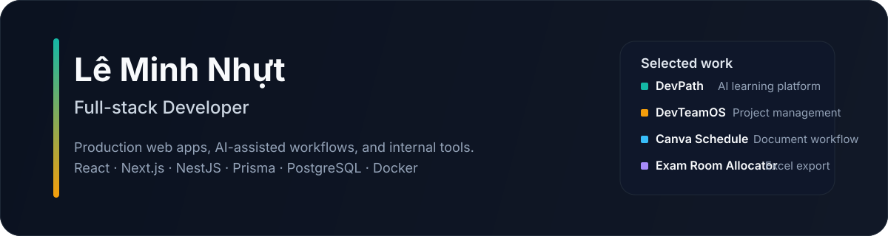

  

  Full-stack developer focused on production web apps, AI-assisted workflows, and internal tools.

  <a href="mailto:leminhnhut.9a10.2019@gmail.com">Email</a> ·
  <a href="https://www.linkedin.com/in/l%C3%AA-minh-nh%E1%BB%B1t-le-9843683a3/">LinkedIn</a> ·
  <a href="https://github.com/MinhNhut05">GitHub</a>

## What I build

- Full-stack web apps with React, Next.js, NestJS, Prisma, PostgreSQL, Redis, and Docker
- Data-heavy UIs for dashboards, admin panels, uploads, reviews, and print/export flows
- AI-assisted product flows for document intake, recommendations, and content generation

## Featured work

| Project | Focus | Stack | Link |
| --- | --- | --- | --- |
| DevPath | AI-assisted learning platform with personalized paths, lessons, quizzes, and tutoring | NestJS, React, Prisma, PostgreSQL, Redis, Docker | [GitHub](https://github.com/MinhNhut05/devpath) |
| DevTeamOS | Kanban project management for small teams with workspace/project structure and role-based access | React, NestJS, Socket.IO, Prisma, PostgreSQL | [GitHub](https://github.com/MinhNhut05/devteam-os) |
| Canva Schedule | Document intake pipeline that turns PDF, DOCX, and Excel inputs into Canva-ready output | Next.js 15, Prisma, PostgreSQL, OpenAI, Canva OAuth, Docker | [Live](https://canva.devteamos.me/) · [GitHub](https://github.com/MinhNhut05/canva-schedule) |
| Exam Room Allocator | Vietnamese exam-room allocation with deterministic sorting, manual edits, and verified Excel export | Next.js 16, ExcelJS, Zod, `@dnd-kit`, Prisma, PostgreSQL | [Live](https://dung.devteamos.me/) · [GitHub](https://github.com/MinhNhut05/excel-cen) |

## Core stack

- Frontend: React, Next.js, Vite, TypeScript, Tailwind CSS, Zustand, React Query
- Backend: NestJS, REST APIs, JWT / OAuth, role-based access control, file processing
- Data: Prisma ORM, PostgreSQL, Redis, structured validation with Zod
- Delivery: Docker, GitHub Actions, VPS deployment, Cloudflare
- AI and integrations: OpenAI, Canva OAuth / API, document extraction and review flows

## Selected experience

**SoHaTravel — Intern Full-stack Developer**

- Built an internal Canva schedule generator end to end with Next.js, Prisma, PostgreSQL, NextAuth, and OpenAI
- Implemented a document-to-AI-to-Canva workflow for PDF, DOCX, and Excel inputs
- Reduced schedule creation time by 70% and shipped the app on Docker to a VPS

## Contact

If you are hiring for junior full-stack roles, reach me at [leminhnhut.9a10.2019@gmail.com](mailto:leminhnhut.9a10.2019@gmail.com).
